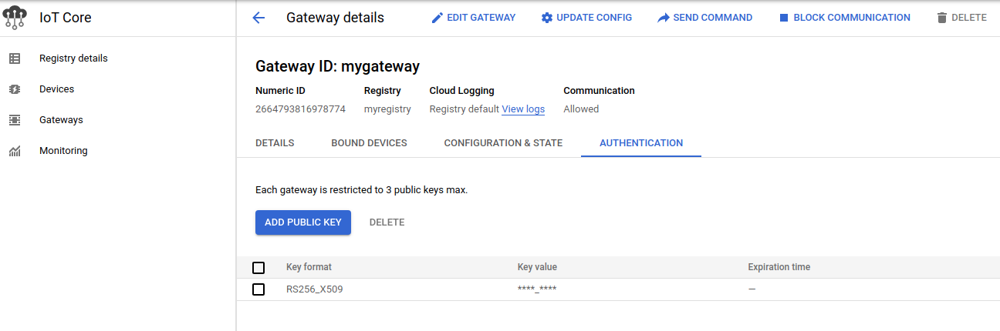

# Google Cloud IoT Core Authentication with Trusted Platform Module (TPM)

A simple demo describing a contrived way to provision and authenticate a device to [Google IoT Core](https://cloud.google.com/iot/docs) where the private key used for authentication is permanently embedded in hardware (a `Trusted Platform Module (TPM)`)

What?  Well, I noticed that the existing documentation for IoT uses openssl to [generate actual key-paris](https://cloud.google.com/iot/docs/how-tos/credentials/keys) that exist as plain files. Thats not particularly secure since...well, its a file.

This tutorial demonstrates the following:

1. create your very own Certificate Authority and subordinate CA
2. create an [IoT Registry](https://cloud.google.com/iot/docs/how-tos/devices) which validates only those devices signed by the subordinate CA
3. create a "device" that has a `TPM` ...well, in our case we are going to pretend a GCP VM is the device and its virtual TPM is a real TPM
4. use the `TPM` to generate an RSA private key that exists only in the TPM
5. use the `RSA` key to create a Certificate Signing Request (`CSR`)
6. use the `CSR` an subordinate CA to sign the `CSR` and get an `x509` certificate for the device
7. create an iot device an gateway
8. assign the device to the gateway and use the `x509` for authentication to iot core
9. when the device needs to send data, it uses the embedded RSA key to sign a `JWT` and use that for `MQTT` authentication

- What does that prove?  

  Just a better way than to use an RSA key file.  

- You're using a VM as the "device"..how does that prove it'll work on a raspberry PI?  

  It doesn't.  I just ordered the [TPM Evaluation Kit with a Raspberry Pi](https://www.mouser.com/new/infineon/infineon-slm9670-eval-board/) this...it'll take a week or so to get here.

  Update  `10/28/11`:
  
  yeah!

  ```bash
  pi@raspberrypi:~ $ uname -a
  Linux raspberrypi 5.10.63-v7+ #1459 SMP Wed Oct 6 16:41:10 BST 2021 armv7l GNU/Linux

  pi@raspberrypi:~ $ tpm2_getrandom 10 --hex
  522ccb70aa96ef3e144f
  ```

- This seems like a lot of manual steps to provision.  This can't possibly scale?

  You're right.  It can't.  I have precisely <1 week of knowledge in IoT stuff but in my reading, here's one way:
  - [TPM 2.0 and Certificate-Based
IoT Device Authentication](https://www.infineon.com/dgdl/Infineon-TPM_2_0_and_certificate_based_IoT_device_authentication-Whitepaper-v01_00-EN.pdf?fileId=5546d4627956d53f01798a8a95830dbb)
  To me, thats basically [TPM Remote attestation](https://tpm2-software.github.io/tpm2-tss/getting-started/2019/12/18/Remote-Attestation.html) which is a pretty standard protocol.
  
  
>> NOTE: this repository is **NOT** supported by google. _caveat emptor_

### TPM Remote Attestation

  A basic flow for how remote attestation works.  Just note that the link above is such that the Verifier is a remote system and the Attestor is a device with the TPM.  THe flow described above is such that the Verifier initiates contact _to_ the attestor and asks it to prove itself.   What we need is probably the bit below where each device contacts a central server and seeks to acquire credentials...so depending on how you look at it, we need pull not push.  Anyway

  1. a device starts off without any a credentials
  2. it contacts a remote "server" and provides the [Endorsement Key (EK)](https://trustedcomputinggroup.org/wp-content/uploads/IWG-EK-CMC-enrollment-for-TPM-v1-2-FAQ-rev-April-3-2013.pdf) used for encryption that was permanently sealed to that TPM by the manufacturer.  The device will also send an [Attestation Key (AK)](https://trustedcomputinggroup.org/wp-content/uploads/IWG-AIK-CMC-enrollment-FAQ.pdf) used for signing which the server will want proof that its associated with the same `EK`.  
  3. the server will encrypt a bit of data (nonce) with the `EK` and `AK` such that it can only get decrypted if the EK and AK are tied to the same TPM.
  4. the device will decrypt the sealed nonce and send that to the sever.
  5. the server will see the decrypted nonce and no associate the `AK` with the device. 
  6. the `AK` is an RSA key on the device that is capable of signatures.  This means that in step 5, the device an also use the `AK` to issue a Certificate Signing Request (`CSR`) and send that to the sever.
  7. after attestation, the server can use a Certificate Authority it uses for IoT device authentication and issue an `x509` cert for that device.
  8. the server returns the `x509` cert to the device.
  9. the device can now use the RSA key that exists only on the TPM to issue a JWT for authentication to IoT Core
  
  Just a minor thing...the `AK` is a special type of key on the TPM and is considered _restricted_ in the sense it will not just sign any random bit of data.  What you normally do is ask the TPM to issue another unrestricted key and use that for arbitrary signing.  I've left those steps out of the flow for clarity.   The RSA key i've sent back is just used for IoT Core authentication...but you can also use another key for mutual TLS connections (mTLS).  
  
  For more information, see 
  
  - [How does TPM key attestation work?](https://docs.microsoft.com/en-us/windows-server/identity/ad-ds/manage/component-updates/tpm-key-attestation#how-does-tpm-key-attestation-work) (just ignore the bits about microsoft specific stuff;  the idea described there is the same).  Also see [Azure IoT Hub Device Provisioning Service](https://docs.microsoft.com/en-us/azure/iot-dps/about-iot-dps#behind-the-scenes)

  - TPM Remote Attestation with grpc  
    * `push server->client` [go_tpm_remote_attestation](https://github.com/salrashid123/go_tpm_remote_attestation).  This repos' `push` branch is a complete client/server which mimics the [TPM Remote attestation](https://tpm2-software.github.io/tpm2-tss/getting-started/2019/12/18/Remote-Attestation.html) document.  In this, the Verifier (server) initiates contact with the attestor.  This isn't what we want but it demonstrates the same concepts.  This repo is quite relevant to this discussion because here the Verifier asks for an unrestricted key from the TPM and then *issues* an x509 certificate for that key using a CA it has.  This is essentially waht we want if we reverse the flow
    * `pull client->server` [go_tpm_remote_attestation](https://github.com/salrashid123/go_tpm_remote_attestation/tree/pull) `pull` branch is what we want here, IMO.  In this flow, the TPM "calls out" to a server and gets registered.

  - TPM based mTLS
    *  Sample repo here shows how you can use a TPM's key for mTLS: [go_tpm_https_embed](https://github.com/salrashid123/go_tpm_https_embed )

  - TPM base HMAC
    * [Importing External HMAC and performing HMAC Signatures](https://github.com/salrashid123/tpm2/tree/master/hmac_import/)
    * [AWS v4 Signer for embedding Access Secrets to PKCS11 and TPMs](https://github.com/salrashid123/aws_hmac)

  - Transfer sealed keys using TPM
    * [Sealing RSA and Symmetric keys with GCP vTPMs](https://github.com/salrashid123/gcp_tpm_sealed_keys)

  - [Using a Trusted Platform Module for endpoint device security in AWS IoT Greengrass](https://aws.amazon.com/blogs/iot/using-a-trusted-platform-module-for-endpoint-device-security-in-aws-iot-greengrass/)


## Setup

Anyway...thats all for a followup repo, we're in pretend-land so i'll use a GCE VM as a device and  my own CA and do things the hard way


### Create CA

The following uses a sample openssl CA and subordinate CA from [ca_scratchpad](https://github.com/salrashid123/ca_scratchpad)

```bash
### Create Root CA
cd ca_scratchpad
mkdir -p ca/root-ca/private ca/root-ca/db crl certs
chmod 700 ca/root-ca/private
cp /dev/null ca/root-ca/db/root-ca.db
cp /dev/null ca/root-ca/db/root-ca.db.attr

echo 01 > ca/root-ca/db/root-ca.crt.srl
echo 01 > ca/root-ca/db/root-ca.crl.srl

openssl genpkey -algorithm rsa -pkeyopt rsa_keygen_bits:2048 \
      -pkeyopt rsa_keygen_pubexp:65537 -out ca/root-ca/private/root-ca.key

openssl req -new  -config root-ca.conf  -key ca/root-ca/private/root-ca.key  -out ca/root-ca.csr  

openssl ca -selfsign     -config root-ca.conf  \
   -in ca/root-ca.csr     -out ca/root-ca.crt  \
   -extensions root_ca_ext

# the root ca is at ca/root-ca.crt

## Create a subordinate CA used for iot certs

mkdir -p ca/iot-ca/private ca/iot-ca/db crl certs
chmod 700 ca/iot-ca/private

cp /dev/null ca/iot-ca/db/iot-ca.db
cp /dev/null ca/iot-ca/db/iot-ca.db.attr
echo 01 > ca/iot-ca/db/iot-ca.crt.srl
echo 01 > ca/iot-ca/db/iot-ca.crl.srl

openssl genpkey -algorithm rsa -pkeyopt rsa_keygen_bits:2048 \
      -pkeyopt rsa_keygen_pubexp:65537 -out ca/iot-ca/private/iot-ca.key

openssl req -new  -config iot-ca.conf -key ca/iot-ca/private/iot-ca.key  -out ca/iot-ca.csr

openssl ca \
    -config root-ca.conf \
    -in ca/iot-ca.csr \
    -out ca/iot-ca.crt \
    -extensions signing_ca_ext

# the iot cert is at ca/iot-ca.crt
```

### Create a registry, gateway


```bash
export PROJECT_ID=`gcloud config get-value core/project`
export PROJECT_NUMBER=`gcloud projects describe $PROJECT_ID --format="value(projectNumber)"`
export REGION=us-central1
export REGISTRY_ID=myregistry
export DEVICE_ID=device2
export GATEWAY="mygateway"
export PUBSUB_TOPIC=iotcore
```

#### Registry

```bash
gcloud pubsub topics create iotcore
gcloud pubsub subscriptions create iotpull --topic iotcore

gcloud iot registries create myregistry --region=$REGION --enable-mqtt-config --log-level=DEBUG \
   --event-notification-config=topic=$PUBSUB_TOPIC --public-key-path=ca_scratchpad/ca/iot-ca.crt
```

#### Gateway

```bash
gcloud iot devices create $GATEWAY \
    --device-type=gateway \
    --project=$PROJECT_ID \
    --region=$REGION \
    --registry=$REGISTRY_ID \
    --auth-method=association-and-device-auth-token
```

### Create a "device" with TPM 


```bash
gcloud compute  instances create   tpm-device     \
   --zone=us-central1-a --machine-type=n1-standard-1 \
   --tags tpm       --no-service-account  --no-scopes  \
   --shielded-secure-boot --shielded-vtpm --shielded-integrity-monitoring  \
   --image=debian-10-buster-v20210916 --image-project=debian-cloud

gcloud compute ssh tpm-device
```

on the VM, setup some stuff

```bash
sudo su -
apt-get update
apt-get install wget git -y

wget https://golang.org/dl/go1.17.2.linux-amd64.tar.gz
tar -C /usr/local -xzf go1.17.2.linux-amd64.tar.gz
export PATH=$PATH:/usr/local/go/bin/
```

#### Create a Certificate Signing Request using TPM

```bash
# the CSR will be written to iot2.csr 
go run csr/csr.go --pemCSRFile iot2.csr --dnsSAN iot2.domain.com  -v 20 -alsologtostderr
```

copy the iot2.csr to your laptop into the  `ca_scratchpad/` folder and sign the csr using the iot CA:

### Sign the CSR

On your laptop, issue an `x509` cert for this `CSR`

```bash
openssl ca     -config iot-ca.conf     -in iot2.csr     -out certs/iot2.crt     -extensions iot_ext

export DEVICE_ID_TPM=device2

gcloud iot devices create $DEVICE_ID_TPM \
    --device-type=non-gateway \
    --registry=$REGISTRY_ID \
    --public-key=path=certs/iot2.crt,type=rs256 \
    --region=$REGION

gcloud iot devices gateways bind --gateway=$GATEWAY \
    --device=$DEVICE_ID_TPM \
    --project=$PROJECT_ID \
    --device-region=$REGION \
    --device-registry=$REGISTRY_ID \
    --gateway-region=$REGION \
    --gateway-registry=$REGISTRY_ID
```

You should end up with something like this

```bash
$ gcloud iot devices list --registry=myregistry --region=us-central1
    ID         NUM_ID            BLOCKED  GATEWAY_TYPE  GATEWAY_AUTH_METHOD
    device2    2627306490721382           NON_GATEWAY
    mygateway  2664793816978774           GATEWAY       ASSOCIATION_AND_DEVICE_AUTH_TOKEN

$ gcloud iot registries list --region=us-central1
    ID          LOCATION     MQTT_ENABLED
    myregistry  us-central1  MQTT_ENABLED
```


### Access IOT from TPM device

On the "device/VM", run

```bash
# download the google root certs
wget https://pki.google.com/roots.pem

go run main.go --projectID $PROJECT_ID --deviceID=device2
```

This will get a JWT and add push some data to the iot device

you can view that data by looking at the topic that its subscribing

```bash
gcloud pubsub subscriptions pull projects/$PROJECT_ID/subscriptions/iotpull --auto-ack 
```

-fin- (sort of)

---


### Reference

#### Using self-signed keys from the device

The example above used a CSR from the device.  You can certainly "just ask" the TPM to generate a Key and use that key to create a self-signed x509 certificate (or just extract the RSA Public key from the TPM).  Either way, you an upload the x509 or RSA Public key to IoT core and directly authenticate.  We're not doing that step but if you wanted to..


#### Create a raw RSA key with the CA to test with locally

If you want to test with an RSA key issued by your own CA just for local testing without a TPM, just ask openssl CA to issue you a cert:


```bash
cd ca_scratchpad
## generate a raw certificate client for an iot device
export NAME=iot1
export SAN=DNS:iot1.domain.com

openssl req -new     -config iot-ca.conf \
  -out certs/$NAME.csr   \
  -keyout certs/$NAME.key \
  -subj "/C=US/O=Google/OU=Enterprise/CN=iot1.domain.com"

# sign the certificate with the iot CA
openssl ca \
    -config iot-ca.conf \
    -in certs/$NAME.csr \
    -out certs/$NAME.crt \
    -extensions iot_ext

# convert the private key to rsa private key (since i hardcoded the type in the go code)
openssl rsa -in certs/$NAME.key -out certs/$NAME-rsa.key
```

then in `main.go` use the PEM signer (i know WTF, why do you have your own `crypto.Signer` for an plain RSA key...).  Its just for testing.  Here are the other [crypto.Signers](https://github.com/salrashid123/signer) << NOTE thats highly dangerzone stuff...i mean, its my own implementations ...its strictly for amusement.  If you're going to use an RSA key with the MQTT library, just read it in normally per the docs  [here](https://gist.github.com/DazWilkin/d45e7b62468419c9929afd77751377cf#file-main-go-L82)

```golang
import (
  salpem "github.com/salrashid123/signer/pem"
)
	r, err := salpem.NewPEMCrypto(&salpem.PEM{
		PrivatePEMFile: "ca_scratchpad/certs/iot1-rsa.key",
	})
	if err != nil {
		fmt.Printf("Error loading PEM %v", err)
		return
	}
```

create the device and attach it

```bash
# create certificate
gcloud iot devices create $DEVICE_ID \
    --device-type=non-gateway \
    --registry=$REGISTRY_ID \
    --public-key=path=ca_scratchpad/certs/iot1.crt,type=rs256 \
    --region=$REGION
```

- Bind cert with device

```bash
gcloud iot devices gateways bind --gateway=$GATEWAY \
    --device=$DEVICE_ID \
    --project=$PROJECT_ID \
    --device-region=$REGION \
    --device-registry=$REGISTRY_ID \
    --gateway-region=$REGION \
    --gateway-registry=$REGISTRY_ID
```

finally, download the root certs and run 

```bash
wget https://pki.google.com/roots.pem


go run main.go --projectID $PROJECT_ID --deviceID=device1
```


### IOTCore API (via Gateway)

The IoT core documentation is really confusing...i couldn't tell if i was using the gateway or even.   It turns out to use the Gateway, you need to directly call[devices/publishEvent](https://cloud.google.com/iot/docs/reference/cloudiotdevice/rest/v1/projects.locations.registries.devices/publishEvent)

Which means you need to use the jwt  Token like this 

```bash
curl -X POST -H "Authorization: Bearer $TOKEN" \
  -H 'content-type: application/json' --data "{\"gateway_info\": {\"gateway_id\": \"$GATEWAY\"}, \"binary_data\": \"Zm9v\"}" \
    -H 'cache-control: no-cache' \
    "https://cloudiotdevice.googleapis.com/v1/projects/$PROJECT_ID/locations/$REGION/registries/$REGISTRY_ID/devices/$DEVICE_ID:publishEvent"
```

If you wanted the use `delegated_device_id`, i kept seeing

```bash
curl -X POST -H "Authorization: Bearer $TOKEN" \
  -H 'content-type: application/json' --data "{\"gateway_info\": {\"delegated_device_id\":\"$DEVICE_ID\"}, \"binary_data\": \"Zm9v\"}" \
    -H 'cache-control: no-cache' \
    "https://cloudiotdevice.googleapis.com/v1/projects/$PROJECT_ID/locations/$REGION/registries/$REGISTRY_ID/devices/$GATEWAY:publishEvent"    
{
  "error": {
    "code": 400,
    "message": "Precondition check failed.",
    "status": "FAILED_PRECONDITION"
  }
}
```

which, you know is really informative...all i needed to do is associate the x509 for the device to the gateway (which means i should also change up the authentication scheme for the device+gateway but i got a bit lazy)

to fix this, the gateway needs the auth


